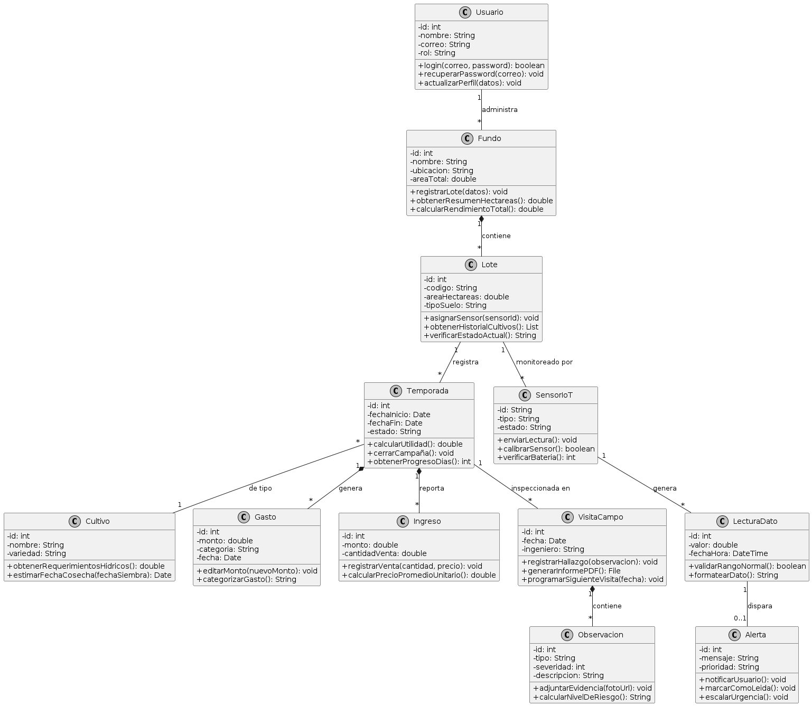

<h3>Universidad Peruana de Ciencias Aplicadas</h3>

 

<strong>Ingeniería de Software - 2026-01</strong> 
<strong>1ASI0729 - Desarrollo de Aplicaciones Open Source</strong> 
<strong>NRC: 11881</strong> 
<strong>Profesor: Efraín Ricardo Bautista Ubillús</strong> 

 <strong>Informe del Trabajo Final</strong>  

<strong>Startup: GreenSpot </strong> 
<strong>Producto: KAMPO</strong> 

### Team Members:

   Hurtado Balcazar Rommel Daniel     u202517474 

 Ramos Fuentes Rivera Adriana Nicole  u202018427 

 Tuesta Girón Kiara Lucia        u20251I477 

 Arroyo Gonzales Emily Juliette     u202311469 

 Acuache Lucas Mathias Joaquin     u202314898 

<strong>26 de Abril de 2026</strong> 

# Registro de Versiones del Informe

**TB1**

| Versión | Fecha      | Autor               | Descripción de modificación                                                                     |
|---------|------------|---------------------|-------------------------------------------------------------------------------------------------|

**TP**

| Versión | Fecha       | Autor               | Descripción de modificación                                       |
|---------|-------------|---------------------|-------------------------------------------------------------------|

**TB2**

| Versión | Fecha      | Autor               | Descripción de modificación                                                                |
|---------|------------|---------------------|--------------------------------------------------------------------------------------------|

**TF**

| Versión | Fecha      | Autor               | Descripción de modificación                                                                                                           |
|---------|------------|---------------------|---------------------------------------------------------------------------------------------------------------------------------------|

# Project Report Collaboration Insights

**TB1**

**TP**

**TB2**

**TF**

**TB1**

**TP1**

**TB2**

**TF**

# Contenido

- [Student Outcome](#student-outcome)
- [Capítulo I: Introducción](#capítulo-i-introducción)
    - [1.1. Startup Profile](#11-startup-profile)
        - [1.1.1. Descripción de la Startup](#111-descripción-de-la-startup)
        - [1.1.2. Perfiles de integrantes del equipo](#112-perfiles-de-integrantes-del-equipo)
    - [1.2. Solution Profile](#12-solution-profile)
        - [1.2.1. Antecedentes y problemática](#121-antecedentes-y-problemática)
        - [1.2.2. Lean UX Process](#122-lean-ux-process)
            - [1.2.2.1. Lean UX Problem Statements](#1221-lean-ux-problem-statements)
            - [1.2.2.2. Lean UX Assumptions](#1222-lean-ux-assumptions)
            - [1.2.2.3. Lean UX Hypothesis Statements](#1223-lean-ux-hypothesis-statements)
            - [1.2.2.4. Lean UX Canvas](#1224-lean-ux-canvas)
    - [1.3. Segmentos objetivo](#13-segmentos-objetivo)
- [Capítulo II: Requirements Elicitation & Analysis](#capítulo-ii-requirements-elicitation--analysis)
    - [2.1. Competidores](#21-competidores)
        - [2.1.1. Análisis competitivo](#211-análisis-competitivo)
        - [2.1.2. Estrategias y tácticas frente a competidores](#212-estrategias-y-tácticas-frente-a-competidores)
    - [2.2. Entrevistas](#22-entrevistas)
        - [2.2.1. Diseño de entrevistas](#221-diseño-de-entrevistas)
        - [2.2.2. Registro de entrevistas](#222-registro-de-entrevistas)
        - [2.2.3. Análisis de entrevistas](#223-análisis-de-entrevistas)
    - [2.3. Needfinding](#23-needfinding)
        - [2.3.1. User Personas](#231-user-personas)
        - [2.3.2. User Task Matrix](#232-user-task-matrix)
        - [2.3.3. User Journey Mapping](#233-user-journey-mapping)
        - [2.3.4. Empathy Mapping](#234-empathy-mapping)
    - [2.4. Big Picture Event Storming](#24-big-picture-event-storming)
    - [2.5. Ubiquitous Language](#25-ubiquitous-language)
- [Capítulo III: Requirements Specification](#capítulo-iii-requirements-specification)
    - [3.1. User Stories](#31-user-stories)
    - [3.2. Impact Mapping](#32-impact-mapping)
    - [3.3. Product Backlog](#33-product-backlog)
- [Capítulo IV: Product Design](#capítulo-iv-product-design)
    - [4.1. Style Guidelines](#41-style-guidelines)
        - [4.1.1. General Style Guidelines](#411-general-style-guidelines)
        - [4.1.2. Web Style Guidelines](#412-web-style-guidelines)
    - [4.2. Information Architecture](#42-information-architecture)
        - [4.2.1. Organization Systems](#421-organization-systems)
        - [4.2.2. Labeling Systems](#422-labeling-systems)
        - [4.2.3. SEO Tags and Meta Tags](#423-seo-tags-and-meta-tags)
        - [4.2.4. Searching Systems](#424-searching-systems)
        - [4.2.5. Navigation Systems](#425-navigation-systems)
    - [4.3. Landing Page UI Design](#43-landing-page-ui-design)
        - [4.3.1. Landing Page Wireframe](#431-landing-page-wireframe)
        - [4.3.2. Landing Page Mock-up](#432-landing-page-mock-up)
    - [4.4. Web Applications UX/UI Design](#44-web-applications-uxui-design)
        - [4.4.1. Web Applications Wireframes](#441-web-applications-wireframes)
        - [4.4.2. Web Applications Wireflow Diagrams](#442-web-applications-wireflow-diagrams)
        - [4.4.3. Web Applications Mock-ups](#443-web-applications-mock-ups)
        - [4.4.3. Web Applications User Flow Diagrams](#443-web-applications-user-flow-diagrams)
    - [4.5. Web Applications Prototyping](#45-web-applications-prototyping)
    - [4.6. Domain-Driven Software Architecture](#46-domain-driven-software-architecture)
        - [4.6.1. Design-Level Event Storming](#461-design-level-event-storming)
        - [4.6.2. Software Architecture Context Diagram](#462-software-architecture-context-diagram)
        - [4.6.3. Software Architecture Container Diagrams](#463-software-architecture-container-diagrams)
        - [4.6.4. Software Architecture Components Diagrams](#464-software-architecture-components-diagrams)
    - [4.7. Software Object-Oriented Design](#47-software-object-oriented-design)
        - [4.7.1. Class Diagrams](#471-class-diagrams)
    - [4.8. Database Design](#48-database-design)
        - [4.8.1. Database Diagrams](#481-database-diagrams)
- [Capítulo V: Product Implementation, Validation & Deployment](#capítulo-v-product-implementation-validation--deployment)
    - [5.1. Software Configuration Management](#51-software-configuration-management)
        - [5.1.1. Software Development Environment Configuration](#511-software-development-environment-configuration)
        - [5.1.2. Source Code Management](#512-source-code-management)
        - [5.1.3. Source Code Style Guide & Conventions](#513-source-code-style-guide--conventions)
        - [5.1.4. Software Deployment Configuration](#514-software-deployment-configuration)
    - [5.2. Landing Page, Services & Applications Implementation](#52-landing-page-services--applications-implementation)
        - [5.2.1. Sprint 1](#521-sprint-1)
            - [5.2.1.1. Sprint Planning 1](#5211-sprint-planning-1)
            - [5.2.1.2. Aspect Leaders and Collaborators](#5212-aspect-leaders-and-collaborators)
            - [5.2.1.3. Sprint Backlog 1](#5213-sprint-backlog-1)
            - [5.2.1.4. Development Evidence for Sprint Review](#5214-development-evidence-for-sprint-review)
            - [5.2.1.5. Execution Evidence for Sprint Review](#5215-execution-evidence-for-sprint-review)
            - [5.2.1.6. Services Documentation Evidence for Sprint Review](#5216-services-documentation-evidence-for-sprint-review)
            - [5.2.1.7. Software Deployment Evidence for Sprint Review](#5217-software-deployment-evidence-for-sprint-review)
            - [5.2.1.8. Team Collaboration Insights during Sprint](#5218-team-collaboration-insights-during-sprint)
        - [5.2.2. Sprint 2](#522-sprint-2)
            - [5.2.2.1. Sprint Planning 2.](#5221-sprint-planning-2)
            - [5.2.2.2. Aspect Leaders and Collaborators.](#5222-aspect-leaders-and-collaborators)
            - [5.2.2.3. Sprint Backlog 2.](#5223-sprint-backlog-2)
            - [5.2.2.4. Development Evidence for Sprint Review.](#5224-development-evidence-for-sprint-review)
            - [5.2.2.5. Execution Evidence for Sprint Review.](#5225-execution-evidence-for-sprint-review)
            - [5.2.2.6. Services Documentation Evidence for Sprint Review.](#5226-services-documentation-evidence-for-sprint-review)
            - [5.2.2.7. Software Deployment Evidence for Sprint Review.](#5227-software-deployment-evidence-for-sprint-review)
            - [5.2.2.8. Team Collaboration Insights during Sprint.](#5228-team-collaboration-insights-during-sprint)
        - [5.2.3. Sprint 3](#523-sprint-3)
            - [5.2.3.1. Sprint Planning 3](#5231-sprint-planning-3)
            - [5.2.3.2. Aspect Leaders and Collaborators](#5232-aspect-leaders-and-collaborators)
            - [5.2.3.3. Sprint Backlog 3](#5233-sprint-backlog-3)
            - [5.2.3.4. Development Evidence for Sprint Review](#5234-development-evidence-for-sprint-review)
            - [5.2.3.5. Execution Evidence for Sprint Review](#5235-execution-evidence-for-sprint-review)
            - [5.2.3.6. Services Documentation Evidence for Sprint Review](#5236-services-documentation-evidence-for-sprint-review)
            - [5.2.3.7. Software Deployment Evidence for Sprint Review](#5237-software-deployment-evidence-for-sprint-review)
            - [5.2.3.8. Team Collaboration Insights during Sprint](#5238-team-collaboration-insights-during-sprint)
        - [5.2.4. Sprint 4](#524-sprint-4)
            - [5.2.4.1. Sprint Planning 4](#5241-sprint-planning-4)
            - [5.2.4.2. Aspect Leaders and Collaborators](#5242-aspect-leaders-and-collaborators)
            - [5.2.4.3. Sprint Backlog 4](#5243-sprint-backlog-4)
            - [5.2.4.4. Development Evidence for Sprint Review](#5244-development-evidence-for-sprint-review)
            - [5.2.4.5. Execution Evidence for Sprint Review](#5245-execution-evidence-for-sprint-review)
            - [5.2.4.6. Services Documentation Evidence for Sprint Review](#5246-services-documentation-evidence-for-sprint-review)
            - [5.2.4.7. Software Deployment Evidence for Sprint Review](#5247-software-deployment-evidence-for-sprint-review)
            - [5.2.4.8. Team Collaboration Insights during Sprint](#5248-team-collaboration-insights-during-sprint)
    - [5.3. Validation Interviews](#53-validation-interviews)
        - [5.3.1. Diseño de entrevistas](#531-diseño-de-entrevistas)
        - [5.3.2. Registro de entrevistas](#532-registro-de-entrevistas)
        - [5.3.3. Evaluaciones según heurísticas](#533-evaluaciones-según-heurísticas)
- [5.4. Video About the Product](#54-video-about-the-product)

- [Conclusiones](#conclusiones)
- [Bibliografía](#bibliografía)
- [Anexos](#anexos)

---

# Student Outcome

### Capítulo I: Introducción
#### 1.1. Startup Profile
##### 1.1.1. Descripción de la Startup

##### 1.1.2. Perfiles de integrantes del equipo

                                                                               

#### 1.2. Solution Profile
##### 1.2.1. Antecedentes y problemática

###### Antecedentes

###### Problemática

##### 1.2.2. Lean UX Process
###### 1.2.2.1. Lean UX Problem Statements

###### 1.2.2.2. Lean UX Assumptions
#### A. BUSINESS OUTCOMES

#### B. USERS OUTCOMES

  
###### 1.2.2.3. Lean UX Hypothesis Statements

###### 1.2.2.4. Lean UX Canvas

#### 1.3. Segmentos objetivo

## Capítulo II: Requirements Elicitation & Analysis
## 2.1. Competidores

##### 2.1.1. Análisis competitivo

##### 2.1.2. Estrategias y tácticas frente a competidores

## 2.2. Entrevistas
##### 2.2.1. Diseño de entrevistas

##### 2.2.2. Registro de entrevistas
Entrevista 01:
- Nombre: Roberto
- Apellido: Azato
- Distrito: Lima
- Resumen:
  El entrevistado se desempeña como asesor técnico independiente, brindando recomendaciones agronómicas a múltiples fundos de manera simultánea. Su trabajo implica visitas periódicas a campo, evaluación del estado de los cultivos y comunicación constante con los propietarios.
  En cuanto a herramientas, utiliza principalmente Excel para el registro de información y WhatsApp como canal principal de comunicación. Esto evidencia una dependencia de herramientas no especializadas, lo que genera dispersión de datos y dificulta la organización de la información.
  Su dinámica de trabajo se basa en la experiencia y en la observación directa, lo que implica que muchas decisiones se toman sin contar con información centralizada o histórica accesible. Además, la elaboración de reportes se realiza de manera manual, lo que incrementa su carga operativa.
  A nivel tecnológico, presenta un manejo intermedio de herramientas digitales, utilizando principalmente su teléfono móvil como dispositivo principal. En términos de comportamiento, se muestra orientado a la eficiencia, pero limitado por procesos manuales.
  Manifiesta interés en una solución que le permita centralizar la información, automatizar reportes y mejorar la comunicación con sus clientes, lo que evidencia una clara necesidad de optimización en su flujo de trabajo.

Entrevista 02:
- Nombre: Nills
- Apellido: Bocanegra
- Edad: 52
- Distrito: Chiclayo
- Resumen:
  El entrevistado realiza labores de supervisión directa en campo, encargándose del seguimiento del estado de los cultivos y de la ejecución de actividades agrícolas.
  Su proceso de trabajo combina registros manuales, como libretas de campo, con herramientas digitales básicas. Esta combinación evidencia una baja integración tecnológica, lo que limita la disponibilidad de información en tiempo real.
  Indica que la información se registra generalmente después de las visitas, lo que genera retrasos en el monitoreo y dificulta la toma de decisiones oportunas. Asimismo, resalta que el clima es un factor determinante en su trabajo, influyendo directamente en decisiones relacionadas con riego, insumos y control de enfermedades.
  Desde el punto de vista tecnológico, presenta un uso básico de herramientas digitales, utilizando principalmente el teléfono móvil como dispositivo de apoyo. Su estilo de trabajo es operativo y reactivo, dependiendo de condiciones cambiantes en campo.
  Muestra apertura hacia el uso de herramientas digitales que permitan registrar información en tiempo real y generar alertas, lo que sugiere una necesidad de mejorar la capacidad de monitoreo continuo.

  Entrevista 03:
- Nombre: Eraldo
- Apellidos: Hurtado Aguirre
- Edad: 62
- Distrito: Trujillo
- Resumen:
  El entrevistado se encarga de la gestión de múltiples fundos, lo que implica coordinar actividades, supervisar cultivos y manejar información proveniente de diversas fuentes.
  Señala que actualmente no cuenta con un sistema que le permita visualizar de manera integrada el estado de los cultivos, lo que incrementa la complejidad en la organización de la información.
  Indica que los datos se encuentran dispersos en diferentes formatos, dificultando el acceso al historial de cultivos y la toma de decisiones basada en información previa. Asimismo, menciona problemas en la comunicación con propietarios o administradores, debido a la falta de canales estructurados.
  En términos tecnológicos, utiliza herramientas básicas y presenta un nivel intermedio de adaptación digital. Su forma de trabajo es principalmente organizativa, enfocada en coordinar múltiples unidades productivas.
  Desde una perspectiva conductual, se observa que valora la claridad y el orden en la información, pero enfrenta limitaciones debido a la falta de herramientas adecuadas. Expresa interés en soluciones que centralicen datos y mejoren la comunicación mediante reportes claros.

Entrevista 04:
- Nombre: Leonardo
- Apellido: Ochoa
- Edad: 54
- Distrito: Lima
- Resumen:
  El entrevistado participa en la gestión de operaciones agrícolas a escala, manejando información proveniente de distintos fundos o unidades productivas.
  Indica que utiliza principalmente Excel y reportes manuales para consolidar información, lo que refleja una alta dependencia de procesos manuales.
  Señala que no cuenta con visibilidad en tiempo real sobre el estado de los cultivos, lo que dificulta la planificación y la proyección de producción. Además, menciona que la toma de decisiones depende de información que muchas veces llega con retraso.
  A nivel tecnológico, presenta familiaridad con herramientas digitales, aunque no utiliza soluciones especializadas. Su enfoque es más estratégico, orientado a la planificación y gestión de recursos.
  Desde el punto de vista conductual, se caracteriza por priorizar la eficiencia y la precisión en la información. Muestra interés en herramientas que permitan integrar datos en tiempo real y mejorar la toma de decisiones a nivel organizacional.

Entrevista 05:
- Nombre: Fernando
- Apellidos: Chunque Muñeco
- Edad: 57
- Distrito: Chiclayo
- Resumen:
  El entrevistado participa en la gestión operativa de actividades agrícolas, dependiendo principalmente de reportes generados por el personal de campo para obtener información sobre los cultivos.
  Indica que la información suele llegar con retraso, lo que limita su capacidad de reacción ante cambios en las condiciones del cultivo y afecta la eficiencia de las operaciones.
  Muestra interés en tecnologías como sensores y monitoreo en tiempo real, aunque expresa preocupación por el costo y la confiabilidad de estas soluciones.
  En cuanto a tecnología, presenta un nivel intermedio de adopción digital, utilizando herramientas básicas para la gestión de información. Su estilo de trabajo es coordinativo, basado en la recepción y validación de datos provenientes de terceros.
  Desde una perspectiva conductual, se observa una orientación hacia la optimización de procesos, pero con una actitud cautelosa frente a nuevas tecnologías. Considera que una solución digital sería viable siempre que demuestre beneficios concretos y confiabilidad.

##### 2.2.3. Análisis de entrevistas
**SEGMENTO 01: Ingenieros agrónomos asesores y supervisores**

A partir de las entrevistas realizadas a ingenieros agrónomos, se identificaron patrones consistentes en cuanto a la gestión de información, limitaciones operativas y necesidades tecnológicas.
En primer lugar, se evidencia una alta dependencia de herramientas no especializadas. El 100 % de los entrevistados utiliza medios como Excel, WhatsApp o registros manuales (libretas de campo) para almacenar y comunicar información. Esta práctica genera una fragmentación de datos, dificultando la consolidación, trazabilidad y acceso oportuno a la información histórica de los cultivos.
Asimismo, se observa que el monitoreo de los cultivos no se realiza en tiempo real, sino que depende principalmente de visitas periódicas o del registro posterior de la información. El 66 % de los entrevistados señaló que esta limitación afecta directamente su capacidad de reacción ante cambios en las condiciones del cultivo, generando retrasos en la toma de decisiones.
Un hallazgo relevante es que el 100 % de los entrevistados considera el clima como un factor determinante en la toma de decisiones agrícolas, influyendo en aspectos como riego, aplicación de insumos y control de enfermedades. Sin embargo, se identificó la ausencia de herramientas que integren variables climáticas en tiempo real o que generen alertas tempranas, lo que incrementa la incertidumbre en la gestión.
Adicionalmente, el 66% de los entrevistados manifestó dificultades en la gestión simultánea de múltiples fundos, lo que incrementa la complejidad operativa. Esta situación se traduce en problemas para organizar la información, acceder a historiales de cultivos y mantener un seguimiento adecuado de cada unidad productiva.
En cuanto a la comunicación, el 66 % indicó que no existen canales estructurados para compartir información técnica con clientes o equipos de trabajo, lo que genera descoordinación y pérdida de información relevante.
No obstante, se identificó una alta predisposición hacia la adopción de soluciones tecnológicas. El 100 % de los entrevistados manifestó interés en utilizar una plataforma que permita centralizar la información, automatizar procesos y mejorar el monitoreo de cultivos. Las funcionalidades más valoradas incluyen el registro histórico, alertas climáticas y generación automática de reportes.
Sin embargo, el 66 % señaló el costo como una barrera significativa, lo que indica que cualquier solución propuesta deberá demostrar claramente su valor en términos de eficiencia y mejora en la toma de decisiones.
En síntesis, este segmento presenta una problemática centrada en la fragmentación de la información, la falta de monitoreo en tiempo real y la ausencia de herramientas especializadas, lo que limita la eficiencia operativa y la calidad de las decisiones técnicas.

**SEGEMENTO 02: Agroindustria mediana y grande**

En el caso del segmento agroindustrial y gestión agrícola a escala, se identifican problemáticas asociadas principalmente a la complejidad operativa, la gestión de grandes volúmenes de información y la necesidad de mayor precisión en la toma de decisiones.
El 100 % de los entrevistados indicó que la gestión de información se realiza mediante herramientas como Excel y reportes manuales generados a partir de datos recolectados en campo. Este enfoque evidencia una alta dependencia de procesos manuales, lo que limita la eficiencia y genera retrasos en la disponibilidad de información.
Asimismo, se identificó que la toma de decisiones depende de múltiples variables críticas, como condiciones climáticas, estado del suelo y presencia de plagas. Sin embargo, la información relacionada a estas variables no se encuentra integrada ni disponible en tiempo real, sino que llega de manera diferida a través de reportes o comunicación con el personal de campo.
Un aspecto clave es que el 100 % de los entrevistados manifestó la falta de visibilidad en tiempo real como una de las principales limitaciones. Esta carencia impacta directamente en la planificación, la proyección de la producción y la capacidad de respuesta ante cambios en el entorno agrícola.
Adicionalmente, se observa que la estructura organizacional de este segmento genera una dependencia de la calidad y oportunidad de la información proveniente de terceros, lo que incrementa el riesgo de errores y decisiones tardías.
En relación con la adopción tecnológica, se identificó interés en soluciones avanzadas como sensores y sistemas de monitoreo en tiempo real. No obstante, el 50 % de los entrevistados expresó preocupaciones relacionadas con el costo de implementación y la confiabilidad de los datos, lo que evidencia la necesidad de soluciones que no solo sean tecnológicamente robustas, sino también económicamente viables.
En conclusión, este segmento enfrenta una problemática centrada en la falta de integración de información, la ausencia de monitoreo en tiempo real y la dependencia de procesos manuales, lo que afecta la eficiencia operativa y la toma de decisiones estratégicas en contextos de alta escala.

## 2.3. Needfinding
##### 2.3.1. User Personas
Las User Personas representan arquetipos construidos a partir de la información recopilada en las entrevistas realizadas a los segmentos objetivo, complementadas con el análisis del contexto del sector agrícola. Estas permiten sintetizar comportamientos, necesidades y problemáticas comunes, facilitando la toma de decisiones en el diseño de soluciones centradas en el usuario.
En este caso, se elaboraron dos User Personas correspondientes a los segmentos identificados: ingenieros agrónomos asesores y actores del sector agroindustrial. Las características incluidas en cada perfil se derivan directamente de los patrones observados en las entrevistas, tales como el uso de herramientas no especializadas, la falta de monitoreo en tiempo real y la necesidad de centralización de información

USER PERSONA 01- Ingeniero agrónomo asesor

  
   

USER PERSONA 02 - Agroindustria mediana y grande

  
   

##### 2.3.2. User Task Matrix
En esta sección se presenta el User Task Matrix considerando los dos segmentos objetivo identificados: ingenieros agrónomos asesores y supervisores, representados por Calor Mendoza, y gestores del sector agroindustrial, representados por Luis Ramos. Las tareas listadas corresponden a actividades que ambos segmentos realizan en su trabajo cotidiano, independientemente de la existencia de la solución propuesta.

| Tarea | Carlos Mendoza (UP1) Frecuencia | Carlos Mendoza (UP1) Importancia | Luis Ramos (UP2) Frecuencia | Luis Ramos (UP2) Importancia |
|:------|:------------------------------:|:--------------------------------:|:---------------------------:|:----------------------------:|
| Visitar fundos en campo | Alta | Alta | Media | Alta |
| Evaluar estado de cultivos | Alta | Alta | Media | Alta |
| Monitorear condiciones climáticas | Alta | Alta | Media | Alta |
| Detectar plagas o enfermedades | Alta | Alta | Baja | Alta |
| Registrar datos de campo | Alta | Alta | Media | Alta |
| Consolidar información de múltiples fundos | Alta | Alta | Alta | Alta |
| Acceder al historial de cultivos | Media | Alta | Media | Alta |
| Decidir sobre riego e insumos | Alta | Alta | Media | Alta |
| Planificar y proyectar producción | Media | Media | Alta | Alta |
| Gestionar recursos operativos | Media | Media | Alta | Alta |
| Comunicarse con clientes / propietarios | Alta | Alta | Media | Media |
| Elaborar reportes de avance | Alta | Alta | Alta | Alta |
| Coordinar con equipos de campo | Media | Media | Alta | Alta |

Las tareas con mayor frecuencia e importancia para ambos segmentos son consolidar información de múltiples fundos y elaborar reportes de avance, lo que evidencia que la gestión de datos es el núcleo operativo compartido entre los dos perfiles. La principal diferencia radica en que Carlos Mendoza realiza visitas directas a campo con alta frecuencia y centraliza su trabajo en la supervisión técnica, mientras que Luis Ramos prioriza la planificación, proyección de producción y coordinación de equipos, tareas que Luis Ramos prioriza la planificación, proyección de producción y coordinación de equipos, tareas que ejecuta con mayor frecuencia que el primer segmento. La coincidencia más relevante es que ambos consideran el monitoreo climático, el acceso al historial de cultivos y la detección de plagas como tareas de alta importancia, aunque actualmente carecen de herramientas que las soporten de manera integrada y en tiempo real.

##### 2.3.3. User Journey Mapping
SEGMENTO 01

  
   

SEGMENTO 02

  
   

##### 2.3.4. Empathy Mapping
El Empathy Mapping permite comprender de manera integral a los usuarios, identificando sus pensamientos, emociones, acciones y entorno. A partir de este análisis, se identifican los principales pains y gains, los cuales permiten detectar oportunidades de mejora y orientar el diseño de la solución propuesta.

USER PERSONA 01

  
   

USER PERSONA 02

  
   

## 2.4. Big Picture Event Storming

## 2.5. Ubiquitous Language

---

## Capítulo III: Requirements Specification
## 3.1. User Stories

## 3.2. Impact Mapping
## 3.3. Product Backlog

---

## Capítulo IV: Product Design
## 4.1. Style Guidelines](#41-style-guidelines)
##### 4.1.1. General Style Guidelines
##### 4.1.2. Web Style Guidelines
## 4.2. Information Architecture
##### 4.2.1. Organization Systems
##### 4.2.2. Labeling Systems
##### 4.2.3. SEO Tags and Meta Tags
##### 4.2.4. Searching Systems
##### 4.2.5. Navigation Systems
## 4.3. Landing Page UI Design
##### 4.3.1. Landing Page Wireframe
##### 4.3.2. Landing Page Mock-up
## 4.4. Web Applications UX/UI Design
##### 4.4.1. Web Applications Wireframes
##### 4.4.2. Web Applications Wireflow Diagrams
##### 4.4.3. Web Applications Mock-ups
##### 4.4.4. Web Applications User Flow Diagrams
## 4.5. Web Applications Prototyping
## 4.6. Domain-Driven Software Architecture
##### 4.6.1. Design-Level Event Storming
##### 4.6.2. Software Architecture Context Diagram

##### 4.6.3. Software Architecture Container Diagrams
##### 4.6.4. Software Architecture Components Diagrams
## 4.7. Software Object-Oriented Design
##### 4.7.1. Class Diagrams

  
   

## 4.8. Database Design
##### 4.8.1. Database Diagrams

---

## Capítulo V: Product Implementation, Validation & Deployment
## 5.1. Software Configuration Management
##### 5.1.1. Software Development Environment Configuration

##### 5.1.2. Source Code Management

### Tipos permitidos:

##### 5.1.3. Source Code Style Guide & Conventions

##### 5.1.4. Software Deployment Configuration

## 5.2. Landing Page, Services & Applications Implementation
##### 5.2.X. Sprint n
###### 5.2.X.1. Sprint Planning n
###### 5.2.X.2. Aspect Leaders and Collaborators
###### 5.2.X.3. Sprint Backlog n
###### 5.2.X.4. Development Evidence for Sprint Review
###### 5.2.X.5. Execution Evidence for Sprint Review
###### 5.2.X.6. Services Documentation Evidence for Sprint Review
###### 5.2.X.7. Software Deployment Evidence for Sprint Review
###### 5.2.X.8. Team Collaboration Insights during Sprint
## 5.3. Validation Interviews
##### 5.3.1. Diseño de Entrevistas
##### 5.3.2. Registro de Entrevistas
##### 5.3.3. Evaluaciones según heurísticas
## 5.4. Video About-the-Product

## Conclusiones
#### Conclusiones y recomendaciones
#### Video About-the-Team

## Bibliografía

## Anexos

